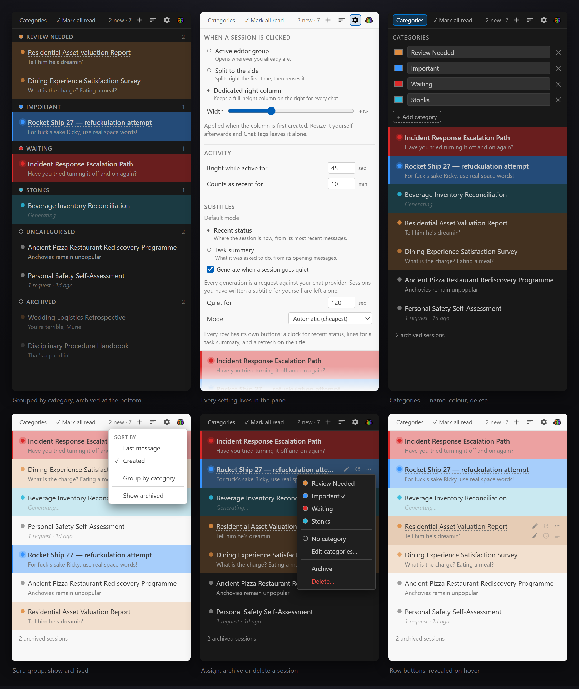

# Chat Tags

Colour-code, categorise and annotate VS Code chat sessions.

<br clear="left">

Twenty chats down the sidebar, all the same shade of grey, all named after whatever shit you happened to type first. One of them is the thing you actually care about. Good luck.

Chat Tags gives them colours, categories, a second line of text, and an archive to shove the dead ones into.



## Why this is a separate view instead of just fixing the real one

Because you can't fix the real one. Not with a hack, not with a proposed API. The surface isn't there.

Three things got checked against VS Code 1.134.0 before a line was written:

| Thing | State |
|---|---|
| `vscode.chat` stable API | One function: `createChatParticipant`. `ChatSession` appears nowhere. |
| `FileDecorationProvider` on the sessions list | Dead end. The viewer renders with `IconLabel`, not `ResourceLabels`, so decorations never get consulted. |
| `chatSessionsProvider` proposed API | Allowlisted to four extensions. Governs only sessions your own extension provides. Can't be published. |

The session model has `label`, `status`, `archived` and pin state. No colour, no tags, no subtitle. Nobody built the hook. That's not an oversight — it just wasn't a thing anyone needed until you had thirty chats open and no bloody idea which was which.

So this sits next to the real list, reads the same files off disk, and draws them the way you wanted them in the first place. It's basically a second opinion.

## What the colours mean

Two signals. They never fight, because they're on different axes.

| Signal | Carries | How it reads |
|---|---|---|
| Hue | Which category | Left stripe plus a wash across the whole row |
| Intensity | Whether it wants you | Resting rows sit at 22%. Attention rows go to 42%. |

**The left border means exactly one thing:** something happened in that session since the last time you opened it. Attention rows also get max wash, a full-strength dot with a halo, and a heavier title. Nothing else in the view draws a left border, so it can never mean two things at once.

Opening a session clears it. **Mark all read** shows up in the toolbar only while there's something to mark.

First run stamps a baseline timestamp. Without it every session you've ever opened lights up as unread on install day, which is a hell of a way to say hello.

Colour attaches to the category, not the chat. Inside a webview colours are plain CSS — no registered-colour cap, no palette limit. Twelve curated ones plus a custom hex field.

## Ordering and grouping

Two orders, in the sort menu:

| Sort by | Reads |
|---|---|
| Last message | The session file's mtime |
| Created | `creationDate` in the session header |

Both newest first. And they are not the same list — across 23 real sessions barely a third of them land in the same place under both, because a chat you started in July and picked up yesterday sits at opposite ends of them.

**Group by category** puts a heading above each category's sessions, in the order you defined them, with everything unassigned dumped under **Uncategorised** at the bottom. A session pointing at a category you deleted lands there too, because where else would it go.

## Archiving and deleting

Two different things. They work differently on purpose.

| | Archive | Delete |
|---|---|---|
| Reversible | Yes | No |
| Touches the session file | No | Yes — removes it |
| Whose state | Chat Tags' | VS Code's |
| The native list | Unaffected | Session disappears |

### Archive is ours

Archived sessions drop out of the list into a section at the bottom, shown only when **Show archived** is on. Until then a footer counts them, because a hidden session with no visible count is how you end up convinced something deleted your chat.

VS Code has its own archived flag — `/clear` sets it — and this deliberately doesn't touch it. That state lives in `state.vscdb` behind the storage service, so an extension can write it and can never read it back. Mirroring would be shouting into a hole: no way to reconcile, no way to notice it drifted. Ours is a timestamp in extension state, same as everything else Chat Tags remembers.

Archived sessions get skipped by the automatic subtitle sweep and don't count towards the unread badge. Something you've put away doesn't get to spend your money or ask for your attention.

### Delete goes through VS Code

**Never by deleting the file.** The session index lives in workspace storage, and the workbench's own delete returns early on an id it doesn't recognise. Rip the file out from under it and the index keeps an entry pointing at nothing, which is a worse mess than the one you started with.

So delete hands the job to the workbench, which clears any open widget, removes the history entry, deletes both files it knows about, and rewrites the index. It runs its own confirmation dialog — names the session, tells you it can't be undone — so Chat Tags doesn't stack a second one on top.

The command resolves whether you confirmed or cancelled, so the file on disk is the only honest evidence of what happened. That outcome goes to the log, and Chat Tags only forgets the session's metadata once the file has actually gone.

## Generated subtitles

A language model can write the second line for you. It can write the title too. Three buttons on every row, and the same three sit in the Command Palette under **Chat Tags**.

What comes back is a status line, not an essay. "Waiting for API key." "Retrying after request errors." That's it. That's the whole feature.

### Three things it can write

| Button | Reads | Answers |
|---|---|---|
| Clock, on the subtitle | The last request/response pair | Where the session is right now |
| Lines, on the subtitle | The first five messages | What it was asked to do |
| Refresh, on the title | The first five messages | What this chat is even about |

Status decays. It's right for something you're still working. Task summary doesn't decay, so it's right for something you'll come back to in a week and stare at blankly.

Every message the model sees goes through a boilerplate filter first, so `@agent Try Again`, terminal notifications and bare acknowledgements — `cool`, `thanks`, `omg yes do it` — never count towards the five. They're not intent. They're noise wearing a request's clothes.

When the end of a session is nothing but noise, the prompt carries no last request at all. A missing line is a better prompt than a misleading one: `Last request: cool` tells a model the topic is the only thing worth mentioning, which is exactly how a status line comes back reading like a title.

### Overwriting something you wrote

A generate button sitting over text you typed yourself is dimmer than the others, and it takes two clicks. The first arms it — lights up, stays visible whether or not you're hovering the row, tooltip flips to *You have customised this subtitle already, confirm regenerate?* The second one fires. It disarms itself after six seconds.

Only hand-written text is guarded. `subtitleSource` and `titleSource` record who wrote each field, so regenerating over a previous generation stays one click, and the automatic sweep skips anything marked `manual` outright.

The armed state lives in the view, not in the session record, so a repaint from the file watcher can't quietly disarm a decision you're halfway through making.

### Renaming a session

**Chat Tags never writes to the session file.** VS Code holds it open and appends to it. A record written underneath gets clobbered on the next flush, and a half-written line takes the whole session with it. Not worth it for a rename.

So titles live in extension state and get drawn over the top, whether you wrote it or the model did. A dotted underline marks a title as ours rather than the session's own. Clear the field and it drops. The native Chat list carries on showing the original either way — no API to change it, same wall the colours hit.

### Which model

The pane lists whatever your window actually offers and defaults to **Automatic**: no selector, then the cheapest family on the table — `mini`, `haiku`, `flash`, `small`, `lite`, `nano`, `turbo`. A subtitle is not worth a frontier model.

Pin one and its id goes in `chatTags.subtitleModel`. Ids come and go with whichever provider you're signed into, so a pinned model that's vanished falls back to matching the value as a family name, then to automatic. The picker keeps showing it marked *not available* instead of silently pretending you chose Automatic.

No models, or consent declined, and the explicit path says so once. The automatic path shuts up for the rest of the window rather than nagging you every sweep.

### What it costs

Off by default. Every generation is a real billable request against whatever provider your window has.

| Guard | |
|---|---|
| Manual subtitles | Never overwritten automatically |
| Concurrency | One request at a time, queued |
| Automatic gap | 20 s minimum between automatic generations |
| Scope | Only sessions that moved since this window opened |
| Prompt size | 536 – 2,387 characters across 23 sessions |
| Title generation | Explicit only — never automatic |
| Timeout | 30 s |

The scope rule is the one doing the heavy lifting. Without it, flicking `chatTags.autoSubtitle` on would backfill every session on your disk in one enthusiastic go, and you'd find out when the bill arrived.

Manual always wins. Edit a generated subtitle and it becomes yours — `subtitleSource` flips to `manual` and the automatic sweep leaves it alone forever after.

A subtitle also remembers which kind it is. Generate a status line and it stays a status line, even where `chatTags.subtitleMode` says `task` — without that the next sweep rewrites your state line back into a task line and there is nothing on screen to explain why.

### What leaves your machine

A prompt is not the same as a tool call. Running the command is what you asked for; handing what it touched to a model provider is a second thing, and session files are full of material that was never meant to travel.

One real session had a live Vaultwarden session token sitting in its tool activity and a password as its last request. Both would have gone out verbatim.

So credentials are masked on the way in:

| Masked | |
|---|---|
| `NAME=value` | where the name ends in `SESSION`, `TOKEN`, `SECRET`, `PASSWORD`, `KEY`, `CREDENTIAL` |
| Spoken passwords | `pw is …`, `password: …` |
| Vendor-prefixed keys | `sk-`, `ghp_`, `xox…-`, `AKIA` and friends |
| Bearer tokens | |
| Private key blocks | |

Deliberately small — a stop on the obvious shapes rather than a scanner, running on the finished prompt so nothing added later slips past it. What it catches becomes `[redacted]`.

This is not a claim that nothing else can leak. Prose you typed is sent as prose you typed. If a session is full of things you would not paste into someone else's window, leave `chatTags.autoSubtitle` off for it.

## Where sessions open

Clicking a session can rearrange your window. Three modes, in the pane under **When a session is clicked**:

| Mode | Behaviour |
|---|---|
| `activeGroup` | Opens wherever you already are. The default. Moves nothing. |
| `beside` | Splits right the first time, then reuses that group. |
| `dedicatedRight` | Keeps a full-height column on the right and throws every chat into it. |

`dedicatedRight` only rewrites the layout when there isn't already a usable right-hand column, so clicking a session doesn't stomp all over an arrangement you set up yourself. The width is `chatTags.dedicatedColumnRatio`.

## Sessions and chat in one pane

The built-in Chat view sets `canMoveView: true`, so you can drag it into the Chat Tags container — sessions above, live chat below, same shape as the built-in dual pane.

Drag the Chat view's title onto the Chat Tags container, or Command Palette → **View: Move View** → Chat → Chat Tags.

What you can't do is render the chat conversation inside this extension's webview. Webviews are sandboxed iframes and workbench UI doesn't project into one. Sharing a container is the actual mechanism, and it's your move to make, not something the extension can declare.

## Settings

Everything lives **in the pane**. Not the view title bar, not the Settings UI. Buttons across the header, one panel open at a time:

| Button | Opens |
|---|---|
| Categories | The category list — colour, name, delete |
| Sort | Order, grouping, archived |
| Gear | Everything else |
| Logo | **View in Extensions** |

Order and grouping get their own menu instead of a row of radio buttons behind the gear. You flip them several times a session. The stuff behind the gear you set once and forget.

Whichever panel is open, its button stays lit until you click it again — that's the only way to close it, so it has to read as pressed rather than merely hovered.

The `⋯` button on a row, or right-click, holds the category list, then **Archive** and **Delete…** under a separator. Everything else on a row is its own button, revealed on hover: a pencil and a refresh on the title, a pencil and two generate buttons on the subtitle. They collapse to zero width when you're not hovering, because holding their place cost every title about 60px for nothing.

Titles and subtitles get edited through their pencils, or by double-clicking the title. Neither one is a click target — the whole row opens the session, and an edit affordance covering half the row made that a coin flip. Clearing the title field restores the session's own.

| Control | Backed by |
|---|---|
| Category colour, name, delete | Extension global state |
| When a session is clicked | `chatTags.openTarget` |
| Width (dedicated column only) | `chatTags.dedicatedColumnRatio` |
| Bright while active for | `chatTags.activeSeconds` |
| Counts as recent for | `chatTags.recentMinutes` |
| Default mode | `chatTags.subtitleMode` |
| Generate when a session goes quiet | `chatTags.autoSubtitle` |
| Quiet for | `chatTags.subtitleIdleSeconds` |
| Model | `chatTags.subtitleModel` |
| Sort by | `chatTags.sortBy` |
| Group by category | `chatTags.groupBy` |
| Show archived | `chatTags.showArchived` |

Every one is a real VS Code setting, so the pane and the Settings UI are two windows onto one stored value rather than two stores having an argument. Edit either.

## Install

```bash
code --install-extension chat-tags-0.10.0.vsix
```

The Chat Tags icon shows up in the activity bar. Every activation writes where it found your sessions to `globalStorage/wulfftech.chat-tags/last-activation.json` — read that first when a window comes up empty, before you start blaming anything else.

## Contributing

Build steps, the probes, the read model internals and every gotcha worth knowing are in [CONTRIBUTING.md](CONTRIBUTING.md).

## Licence

MIT. See [LICENSE](LICENSE).
